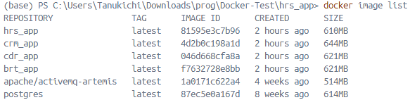
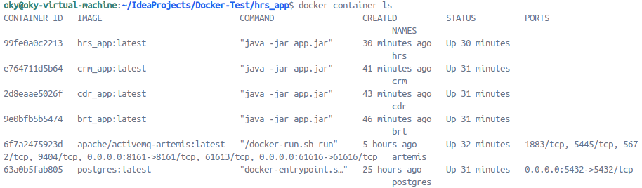
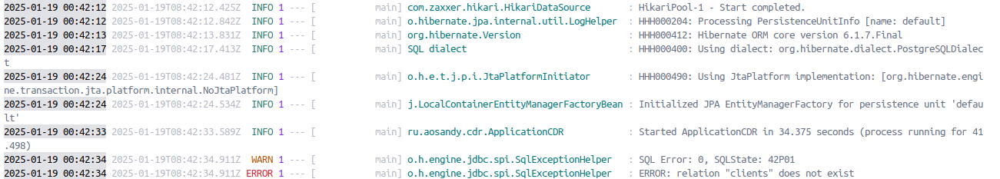
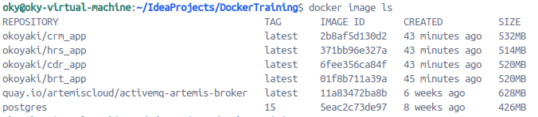
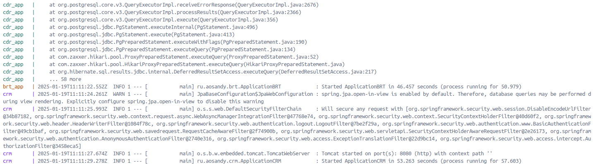
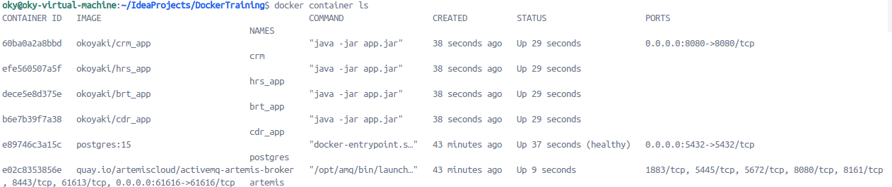

# Docker-Test
Данный проект был разработан в рамках практического занятия курса "Методология разработки программного обеспечения DevOps" студентом Шушаков М.С.

В данном проекте отсутствуют сами архивы .jar, по причине ограничений в размере загружаемых файлов. На деле все архивы расположены в соответствующих папках приложений в директории /target.
## 1. Dockerfile
Для каждого приложения были созданы Dockerfile, в соответствии с приведенными в задании примерами. В содержании Докер файлов этого проекта указан код из примера №2, поскольку операции сбора image и запуска контейнеров успешно выполнились для примера №1.

В качестве устанавливаемой версии java была взята версия java-17-openjdk, поскольку приложения были построены на основе java 17.
## 2. Docker image
После клонирования репозитория DockerTraining, указаного в задании, была проведена сборка приложений через команду `mvn clean package -Dmaven.test.skip`. Далее созданные Докер файлы были загружены в соответствующие папки приложений.

После сборки приложений была проведена сборка image для каждого из них. Формат названия image был взят в виде `<название_приложения>_app`. Также были получены image PostgreSQL и Artemis, поскольку они также используются в проекте.

Ниже приведен список полученных image. 

## 3. Docker container
Проведен запуск и настройка контейнеров PostgreSQL и Artemis, добавлена пустая база данных nexign-task, к которой приложения будут подключаться. PostgreSQL слушает порт 5432, Artemis - 61616 и 8161. Контейнеры приложений также успешно запустились. 

Приложение CDR выдает предупреждение об отсутствии отношения clients, но работает успешно. Причина этому - отсутствие наполнения базы данных, поскольку было принято решение не использовать данные из liquibase.

## 4. Docker compose
После проверки работы полученных image и контейнеров можно переходить к написанию `docker-compose.yaml`, в котором описывается конфигурация сборки и запуска приложений. 

Для каждого из приложений была описана конфигурация сборки, формат названий image взят в виде `okoyaki/<название_приложения>_app`, для дальнейшей загрузки полученных image на Docker Hub. Также конфигурация была описана и для PostgreSQL и Artemis.

## 5. Docker image, с использованием Docker compose
Далее все приложения были пересобраны с использованием docker compose. Ниже приведен список полученных image.

## 6. Docker container, с использованием Docker compose
После сборки приложений был запущен один большой контейнер, содержащий все 6 приложений под названием DockerTraining. Все из них успешно запустились, приложение CDR всё также выдает предупреждение об отсутствии отношения clients. Ниже приведены общие логи и список запущенных контейнеров

## 7. Docker Hub
Была проведена регистрация в Docker Hub и сгенерирован Access Token. Все полученные image, в результате сборки через docker compose были запушены в Hub под названиями okoyaki/<имя_приложения>_app. Пример: https://hub.docker.com/r/okoyaki/brt_app

